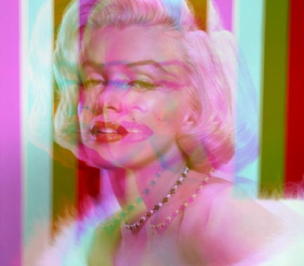

# Создание стилизованной аватарки из исходной фотографии

Обработка исходной фотографии и сохранение нового изображения в нужном размере.

# Пример

**Исходная фотография**


**Итоговый результат**



### Как установить

Python3 должен быть уже установлен.
Затем используйте `pip` для установки зависимостей:
```
pip install -r requirements.txt
```


### Цель проекта

Код написан в образовательных целях на онлайн-курсе для веб-разработчиков [dvmn.org](https://dvmn.org/).
